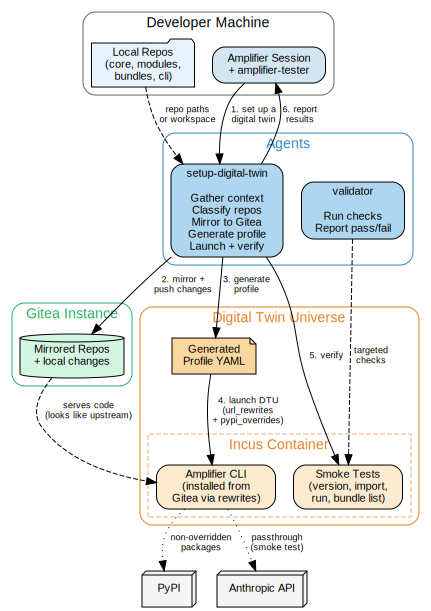

# Amplifier Bundle Amplifier Tester

Validates Amplifier ecosystem changes (bundles, modules, prompts, app-cli, core, foundation) in isolated [Digital Twin Universe](https://github.com/microsoft/amplifier-bundle-digital-twin-universe) environments before they reach real users.

The bundle dynamically generates the right profile based on what you actually changed using an agent.
Then the ecosystem validator mirrors your local repos to Gitea, builds the correct `url_rewrites` and `pypi_overrides`, launches a DTU, and runs validation checks.




## Prerequisites

This bundle depends on the Digital Twin Universe bundle (which itself depends on
[amplifier-bundle-gitea](https://github.com/microsoft/amplifier-bundle-gitea)).
See their READMEs for prerequisite setup:

- [Digital Twin Universe prerequisites](https://github.com/microsoft/amplifier-bundle-digital-twin-universe#prerequisites)
- [Gitea prerequisites](https://github.com/microsoft/amplifier-bundle-gitea#prerequisites)


## Installation

If you use `amplifier-foundation`, this bundle is included automatically and the `amplifier-tester:setup-digital-twin` and `amplifier-tester:validator` agents are already available. No install required.

To compose into a custom bundle (without foundation), reference the behavior:

```bash
amplifier bundle add "git+https://github.com/microsoft/amplifier-bundle-amplifier-tester@main#subdirectory=behaviors/amplifier-tester.yaml" --app
```

`--app` composes the bundle onto every Amplifier session. Remove it to only register the bundle for later activation with `amplifier bundle use`.

This bundle doesn't ship a runtime (no provider, orchestrator, or tools) — it must be composed onto a bundle that does, like `amplifier-foundation`.


## What It Validates

- **Core** (`amplifier-core`) -- PyPI override with a locally built wheel, version check, Python import check
- **Module** (`amplifier-module-*`) -- URL rewrite to Gitea, smoke test exercises the module
- **Bundle** (`amplifier-bundle-*`) -- URL rewrite + `bundle add`, verify bundle loads and agents are available
- **CLI** (`amplifier`, `amplifier-app-cli`) -- URL rewrite for install source, help + smoke test
- **Foundation** (`amplifier-foundation`) -- URL rewrite, bundle loading works
- **Prompt/context** (agent `.md` or context files in a bundle) -- same as bundle, since prompt changes live in bundles
- **Multi-repo** (any combination of the above) -- all strategies combined in a single profile


## Agents

- **[Setup Digital Twin](agents/setup-digital-twin.md)** -- gathers context from the user and/or workspace, classifies changes, mirrors to Gitea, generates a DTU profile, launches and verifies the environment.
- **[Ecosystem Validator](agents/validator.md)** -- runs targeted validation checks inside the DTU and reports pass/fail results.


## Typical Flow

```
"Validate my changes to ~/repos/amplifier-module-provider-anthropic"
```

1. **setup-digital-twin** inspects the repo, classifies it as a module change
2. Reuses or creates a Gitea instance, mirrors from GitHub, pushes local changes on top
3. Generates a DTU profile with the correct `url_rewrites`
4. Launches the DTU -- Amplifier installs inside thinking it's pulling from upstream
5. Verifies: CLI starts, provider loads, smoke test passes
6. Reports results

For multi-repo changes:
```
"Validate my changes to ~/repos/amplifier-core and ~/repos/amplifier-module-provider-anthropic"
```

Both repos get mirrored. A single profile is generated with `pypi_overrides` for core
AND `url_rewrites` for the module. One DTU tests everything together.


## Re-testing After Fixes

The generated DTU profiles include an `update` section. After fixing an issue:

1. Commit the fix locally
2. Push to Gitea (`git push gitea HEAD:main --force`)
3. `amplifier-digital-twin update <instance-id>`
4. Re-run validator

No need to destroy and relaunch.


## Scope

**In scope:** Amplifier ecosystem repos -- core, foundation, modules, bundles, app-cli.

**Out of scope:** Arbitrary user apps (use [reality-check](https://github.com/microsoft/amplifier-bundle-reality-check) for that),
mock services, browser-based UI testing, resolver integration.


## Contributing

> [!NOTE]
> This project is not currently accepting external contributions, but we're actively working toward opening this up. We value community input and look forward to collaborating in the future. For now, feel free to fork and experiment!

Most contributions require you to agree to a
Contributor License Agreement (CLA) declaring that you have the right to, and actually do, grant us
the rights to use your contribution. For details, visit [Contributor License Agreements](https://cla.opensource.microsoft.com).

When you submit a pull request, a CLA bot will automatically determine whether you need to provide
a CLA and decorate the PR appropriately (e.g., status check, comment). Simply follow the instructions
provided by the bot. You will only need to do this once across all repos using our CLA.

This project has adopted the [Microsoft Open Source Code of Conduct](https://opensource.microsoft.com/codeofconduct/).
For more information see the [Code of Conduct FAQ](https://opensource.microsoft.com/codeofconduct/faq/) or
contact [opencode@microsoft.com](mailto:opencode@microsoft.com) with any additional questions or comments.

## Trademarks

This project may contain trademarks or logos for projects, products, or services. Authorized use of Microsoft
trademarks or logos is subject to and must follow
[Microsoft's Trademark & Brand Guidelines](https://www.microsoft.com/legal/intellectualproperty/trademarks/usage/general).
Use of Microsoft trademarks or logos in modified versions of this project must not cause confusion or imply Microsoft sponsorship.
Any use of third-party trademarks or logos are subject to those third-party's policies.
